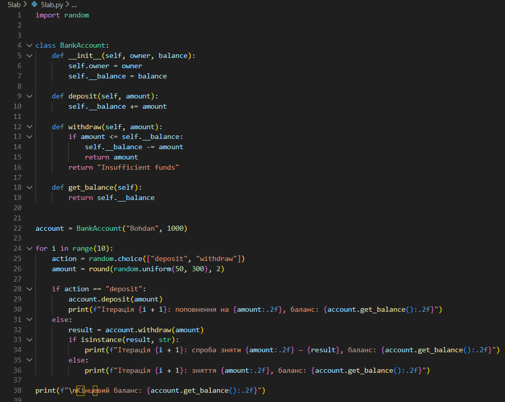
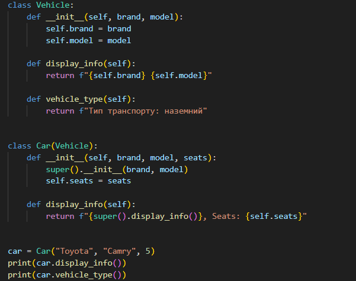
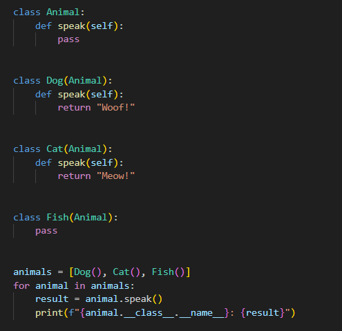
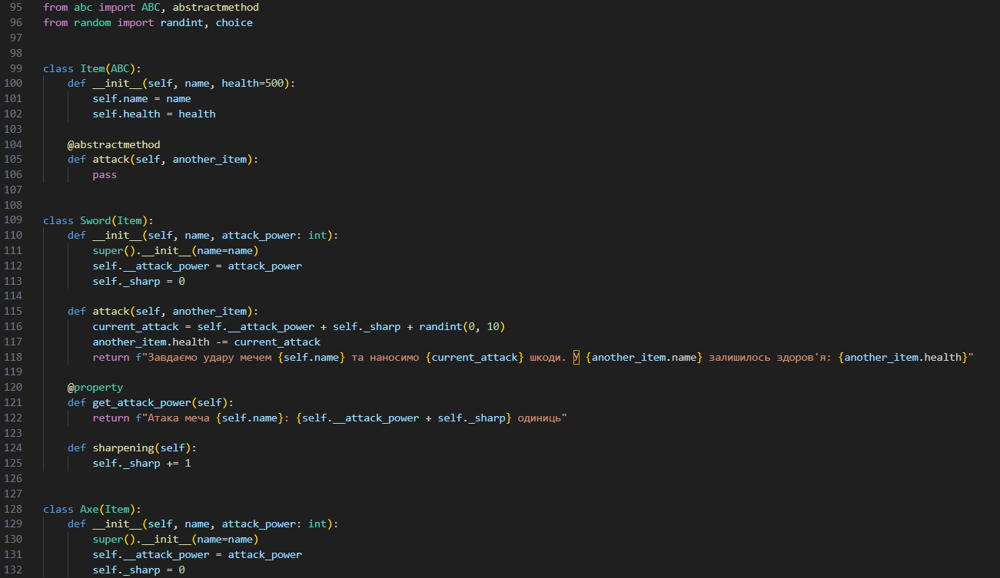
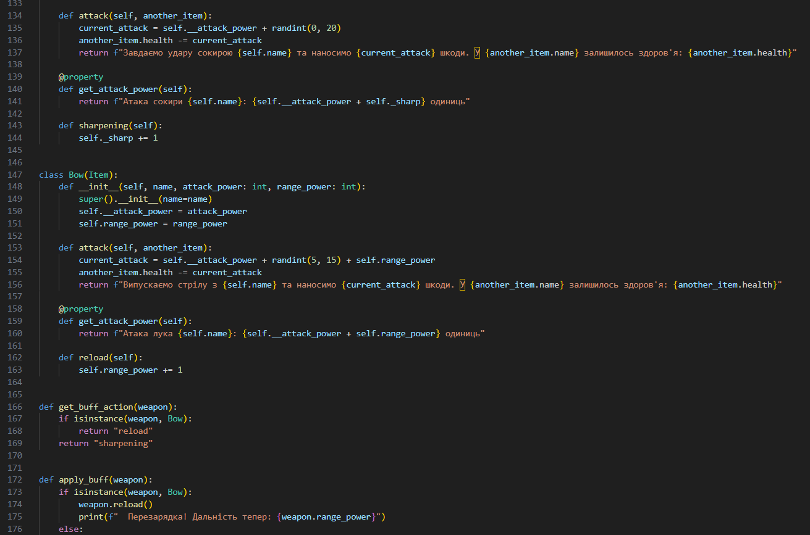
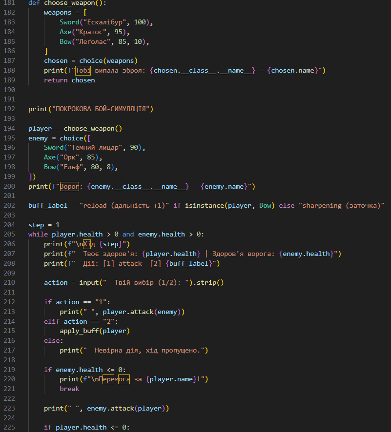

# Звіт до роботи

### Тема: Основні парадигми ООП

### Мета роботи: Ознайомитись з ключовими поняттями об’єктно-орієнтованого програмування (ООП) у Python та навчитися реалізовувати їх у власних класах на прикладі ігрової симуляції.

Виконання роботи: 
Результати виконання завдання 1–4:
- Розробили класи з використанням чотирьох парадигм ООП іі.
Програма вивела результати роботи кожного завдання іі. 
Отримано наступні результати: баланс рахунку, інформація про авто, звуки тварин, бойова симуляція
iv. Навчились застосовувати інкапсуляцію, наслідування, поліморфізм та абстракцію
- вставлені скріншоти виконаного завдання у зошит
- вставлений код:

## 1

## 2

## 3

## 4

# Висновок:
- Що зроблено в роботі: реалізовано 4 парадигми ООП на Python
- Чи досягнуто мету роботи: так
- Які нові знання отримано: навчились писати класи, використовувати super(), ABC, @abstractmethod, @property
- Чи вдалось виконати всі завдання: так