# Звіт до роботи

## Тема: Віртуальні середовища
## Мета роботи: 
Ознайомитися з інструментами управління пакетами в Python (pip), навчитися створювати ізольовані віртуальні середовища за допомогою venv, pipenv та poetry, а також здобути практичні навички роботи зі сторонніми API за допомогою бібліотек requests, jikanpy та мікрофреймворку Flask.

#                Хід роботи
- ### Блок 1 (Основи роботи з pip та бібліотекою requests)
Опис дій: На першому етапі було перевірено список встановлених пакетів у системі. Після цього за допомогою бібліотеки requests було виконано HTTP-запит до сторінки https://www.google.com/search?q=google.com та виведено інформацію про статус відповіді, кодування та заголовки. Також було відпрацьовано механізм керування версіями пакетів: встановлення конкретної версії (requests==2.1) та подальше її видалення.

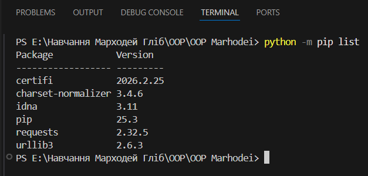

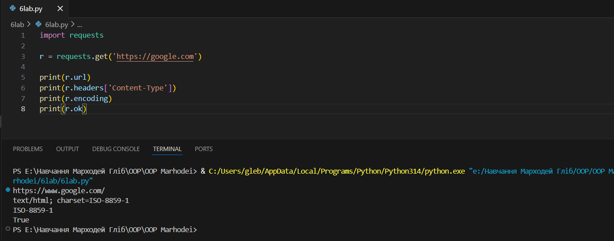

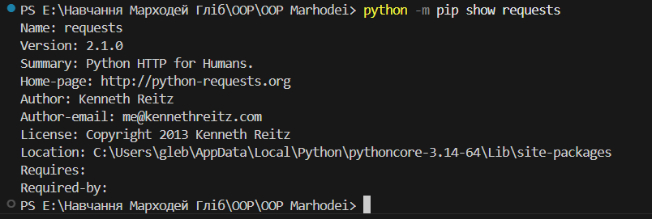

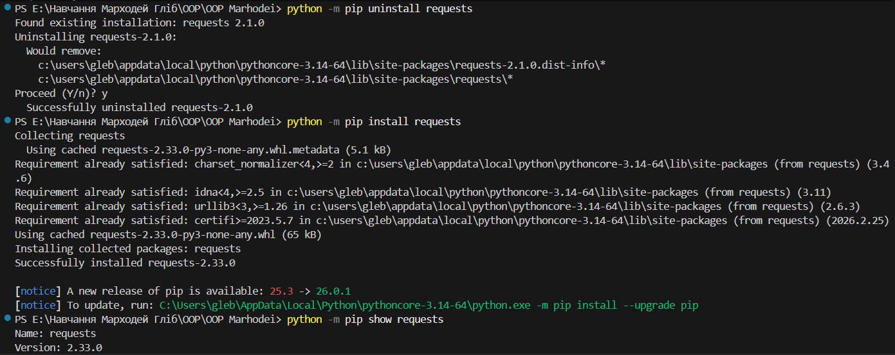

-  ### Блок 2 (Робота з API та створення локального сервера (Flask)):
Опис дій: Для роботи з Jikan API було встановлено бібліотеки jikanpy та вебфреймворк Flask. Було створено скрипт anime.py, який отримує дані про епізоди обраного аніме та виводить їх на локальному вебсервері. Додатково було виконано завдання із зірочкою: створено скрипт для отримання списку з 15 аніме поточного сезону та їх оцінок із виведенням результату в консоль.

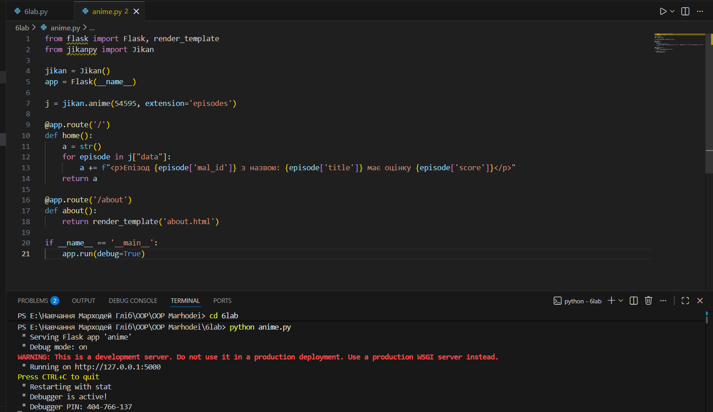

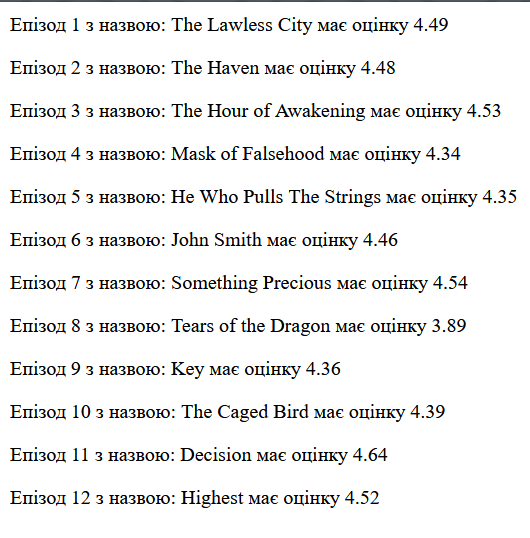

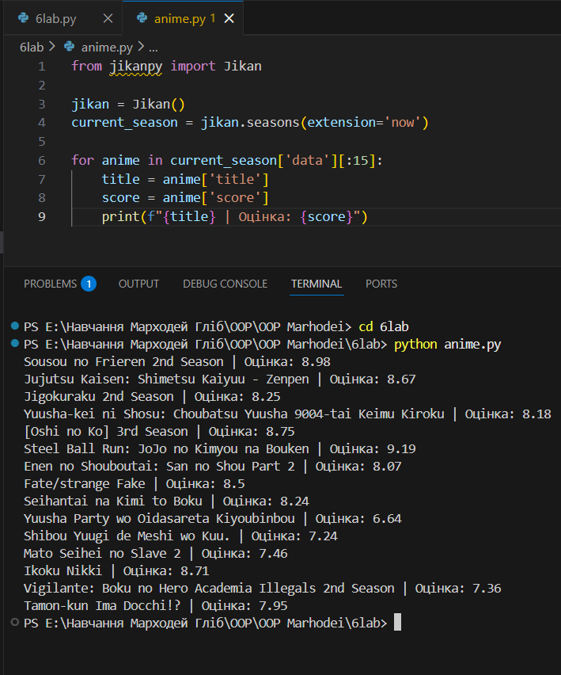

- ### Блок 3 (Ізоляція середовища за допомогою venv)
Опис дій: Для уникнення конфліктів версій було створено ізольоване віртуальне середовище за допомогою вбудованого модуля venv. Після активації середовища було перевірено відсутність глобальних пакетів (чистий pip list) та успішно встановлено пакет requests виключно для даного середовища. Після завершення роботи середовище було деактивовано.

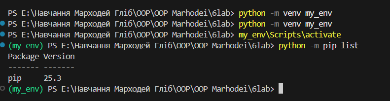

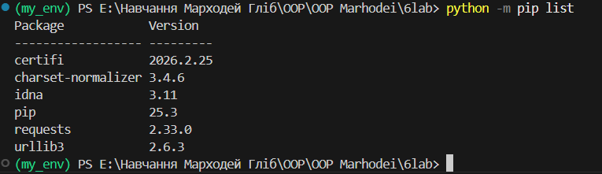

- ### Блок 4 (Використання менеджера пакетів pipenv)
Опис дій: Було протестовано альтернативний інструмент для керування залежностями — pipenv. У новому середовищі було встановлено лише пакет requests. Для перевірки ізольованості було здійснено спробу запустити скрипт anime.py (який потребує Flask). Отримана помилка ModuleNotFoundError підтверджує, що середовище повністю ізольоване від глобальних пакетів системи.

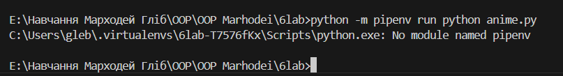

- ### Блок 5 (Робота з сучасним інструментом Poetry)
Опис дій: На фінальному етапі було використано інструмент Poetry. Було проведено ініціалізацію проєкту (генерація файлу конфігурації) та додано залежність requests. Запуск скрипта anime.py через poetry run також завершився очікуваною помилкою відсутності модуля, що вкотре доводить ефективність використання віртуальних середовищ для ізоляції проєктів.

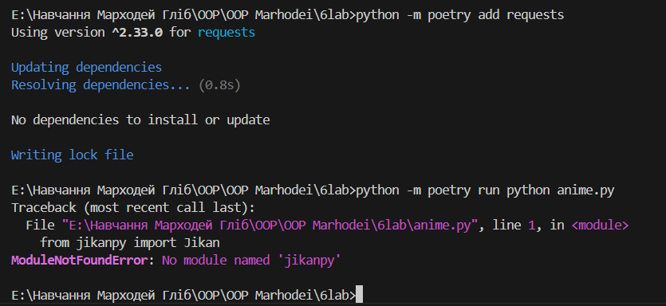

## Висновок: 
Під час виконання лабораторної роботи я закріпив навички роботи з менеджером pip та сторонніми бібліотеками (requests, Flask, jikanpy), навчившись виконувати HTTP-запити та працювати з відкритим API. Головним результатом стало успішне створення віртуальних середовищ трьома способами: за допомогою venv, pipenv та poetry. Практичне тестування довело їхню повну ізоляцію від глобальних пакетів системи, що підтверджує необхідність використання цих інструментів для уникнення конфліктів версій у проєктах.