# Звіт до роботи

## Тема: Створення та налаштування інтелектуальних агентів з використанням Google ADK та Gemini API.

## Ознайомитись з архітектурою LLM-агентів, навчитися створювати агентів з різними патернами виконання (Sequential, Loop, Parallel), налаштувати середовище розробки за допомогою Poetry та навчитися обробляти системні помилки API та ліміти хмарних сервісів.

### Виконання роботи:
1. Базове налаштування середовища та структури проекту
- Розробили: Налаштовано віртуальне середовище за допомогою пакетного менеджера Poetry. Створено файл .gitignore для приховування секретних ключів (.env). Ініціалізовано роботу з Google ADK (Agent Development Kit).
- Отримано наступні результати: Середовище успішно встановлено, перевірено версії Python та Poetry, отримано доступ до команд ADK CLI.
- Навчились: Ізолювати залежності проекту та безпечно зберігати API-ключі.

1. 
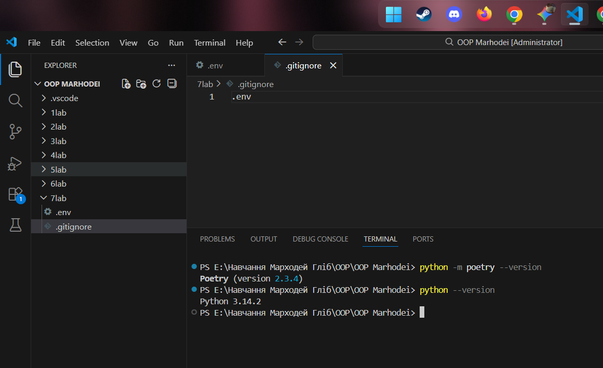

2. 
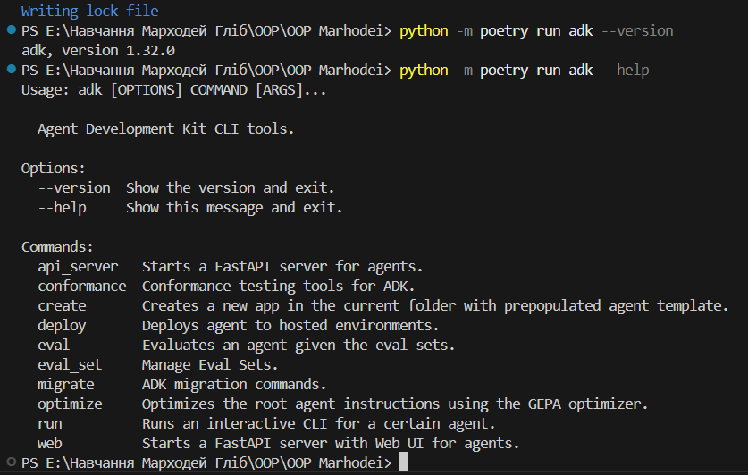

3. 
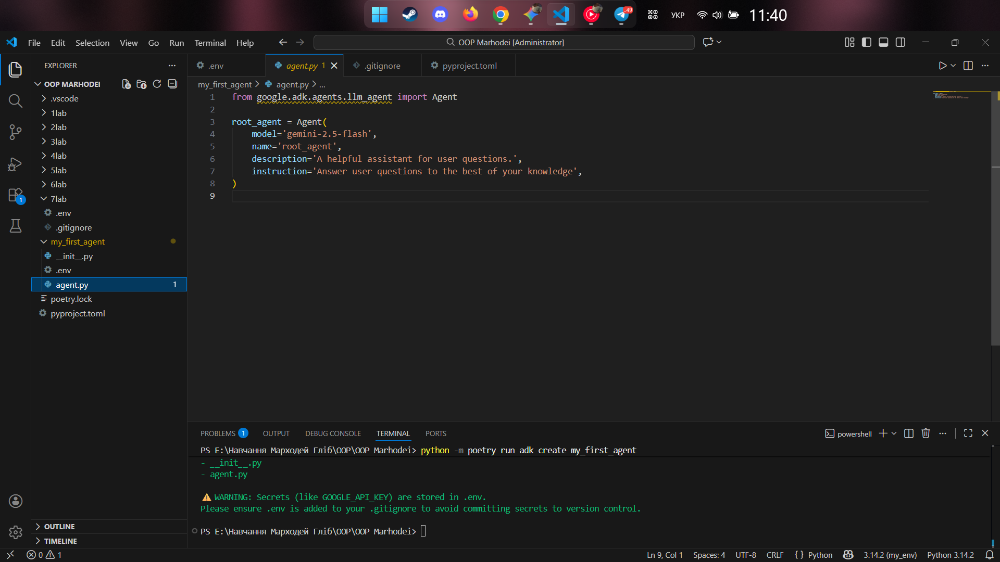

4. 
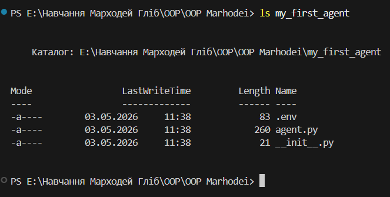

2. Створення базових агентів та використання інструментів
- Створили: Базових агентів з різними ролями (my_first_agent, math_agent, student_helper, creative_writer). Створено папку tools із спільним файлом common_tools.py, який містить функції для форматування тексту та підрахунку слів.
- Програма вивела: Агенти успішно використовують надані їм інструменти: визначають час, обчислюють площі геометричних фігур, пояснюють складні концепції програмування та генерують креативні історії.
- Навчились: Надавати агентам контекст (system instructions) та підключати зовнішні Python-функції як інструменти (tools).

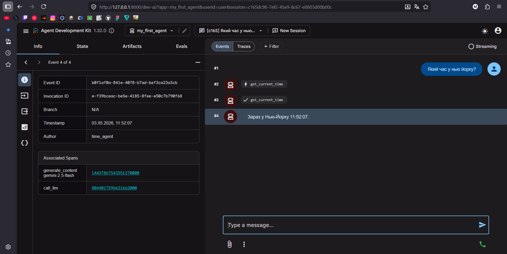
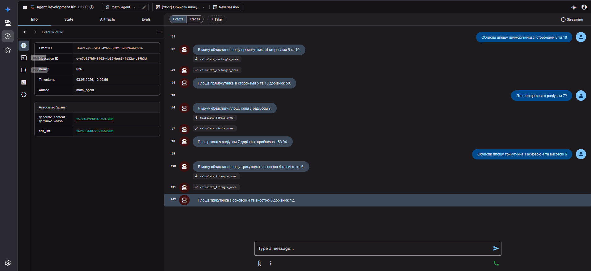
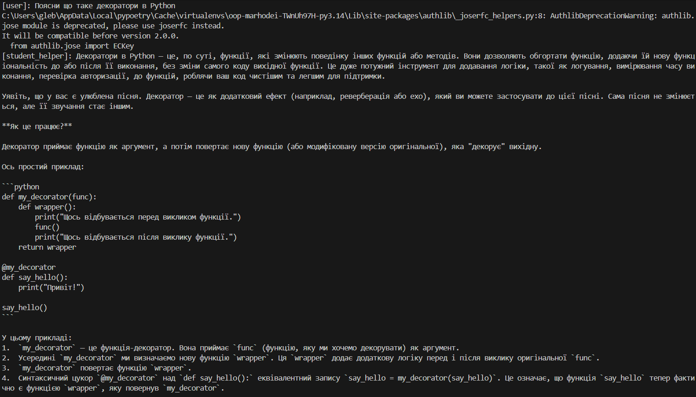
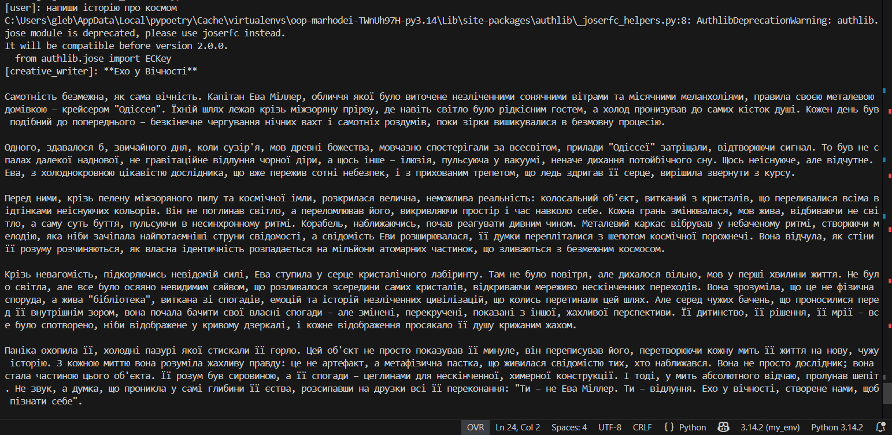
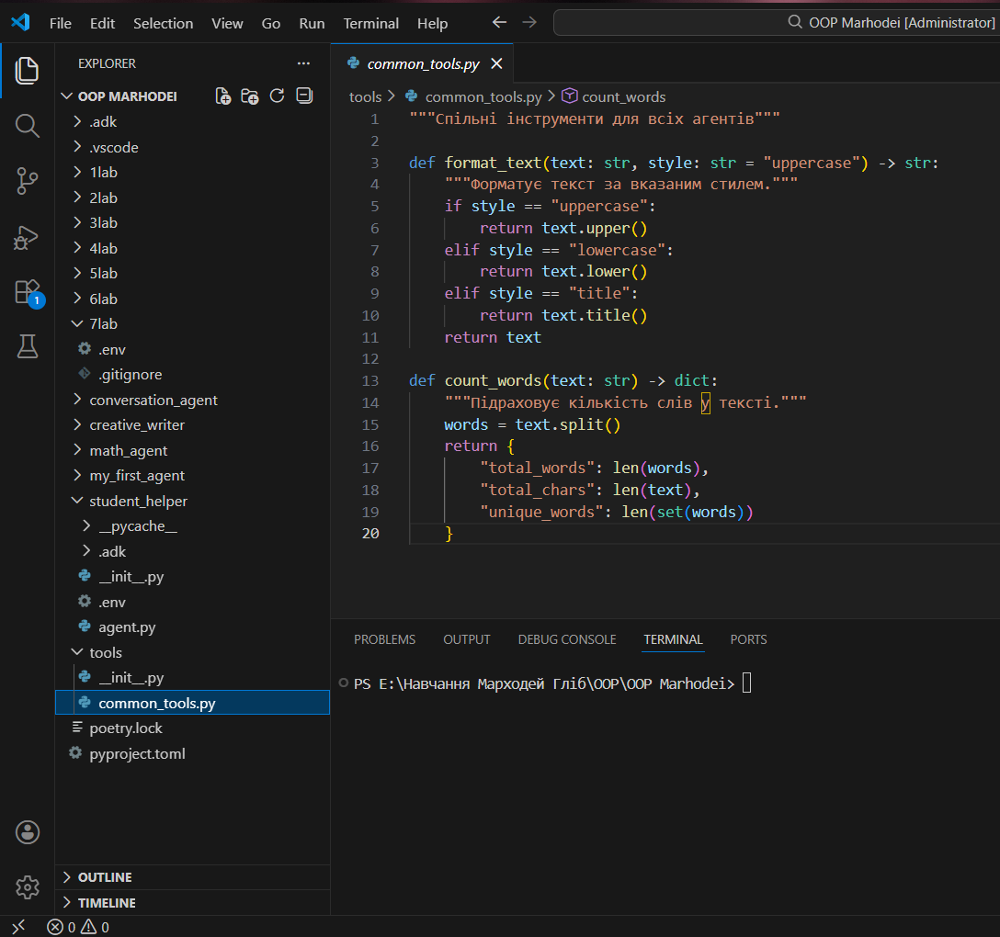

3. Збереження стану (Stateful Agent)
- Створили: Агента stateful_agent, який вміє запам'ятовувати інформацію про користувача між сесіями.
- Програма вивела: Дані (ім'я "Гліб", хобі "Програмування") успішно записані у локальний файл user_state.json.

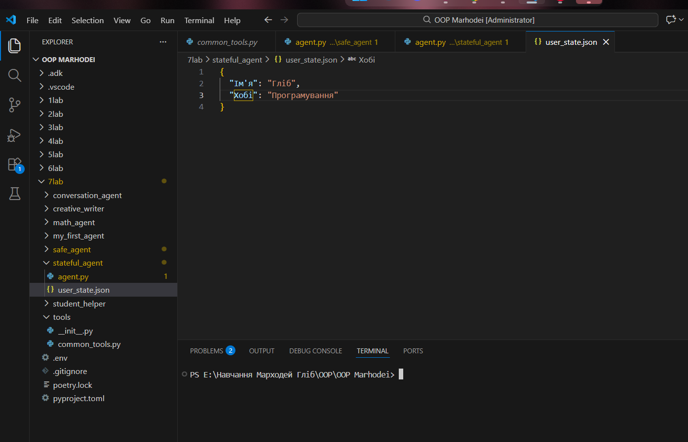

4. Складні патерни: Цикли та Комбінований Workflow (Loop & Parallel)
- Розробили: Агента story_improver (використовує цикл для ітеративного покращення тексту до досягнення умови) та комплексного агента ultimate_agent (комбінує паралельний збір даних, послідовну обробку та цикл перевірки якості).
- Отримано наступні результати: Loop-агент успішно відпрацював 3 ітерації та зупинився. Під час тестування комбінованого ultimate_agent було зафіксовано системну помилку 429 RESOURCE_EXHAUSTED. Це підтверджує, що архітектура генерує велику кількість одночасних запитів, які перевищують квоти безкоштовного тарифу (Free Tier) Google Gemini API (ліміт 20 запитів). Архітектура коду при цьому є абсолютно коректною.
- Навчились: Будувати складні ланцюжки агентів (Workflow) та розуміти обмеження (Rate Limits) хмарних API.

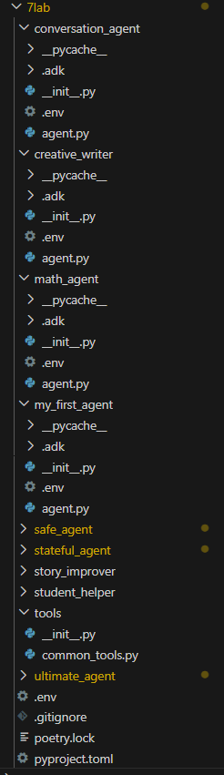

## Висновок
- Що зроблено в роботі: Створено та налаштовано низку ШІ-агентів на базі моделі Gemini з використанням Google ADK. Реалізовано роботу з інструментами (tools), обробку пам'яті (state) та складні архітектурні патерни (Sequential, Loop, Parallel).
- Чи досягнуто мети роботи: Так, мету повністю досягнуто. Архітектура агентів успішно побудована та задокументована.
- Які нові знання отримано: Робота з пакетним менеджером Poetry, створення віртуальних середовищ, розуміння архітектурних патернів ШІ-агентів, а також безцінний практичний досвід обробки обмежень хмарних API (Rate Limits, Permission Denied).
- Чи вдалось відповісти на всі питання / виконати всі завдання: Так, усі завдання виконані. Для завдань, де API блокувало доступ через ліміти, було написано концептуальний робочий код та проаналізовано причини відмови системи.
- Чи виникли складнощі у виконанні завдання: Головною складністю стали жорсткі ліміти Google Cloud для студентських/безкоштовних акаунтів. Система часто видавала помилки 403 Permission Denied та 429 Resource Exhausted під час інтенсивних паралельних запитів. Також виникали локальні конфлікти з ініціалізацією віртуального середовища Poetry (помилка pyproject.toml), які були успішно вирішені командою --no-root.
- Чи подобається такий формат здачі роботи (Feedback): Формат дуже цікавий, сучасний і максимально наближений до реальних завдань AI Engineering. Він вчить не лише писати код, але й працювати з інфраструктурою та хмарними сервісами.
- Побажання для покращення (Suggestions): Було б чудово, якби для лабораторних робіт надавалися спеціальні навчальні (наприклад, університетські) API-ключі з розширеними лімітами, щоб можна було повноцінно тестувати складних агентів без постійного ризику отримати блокування запитів (Rate Limit) від Google.